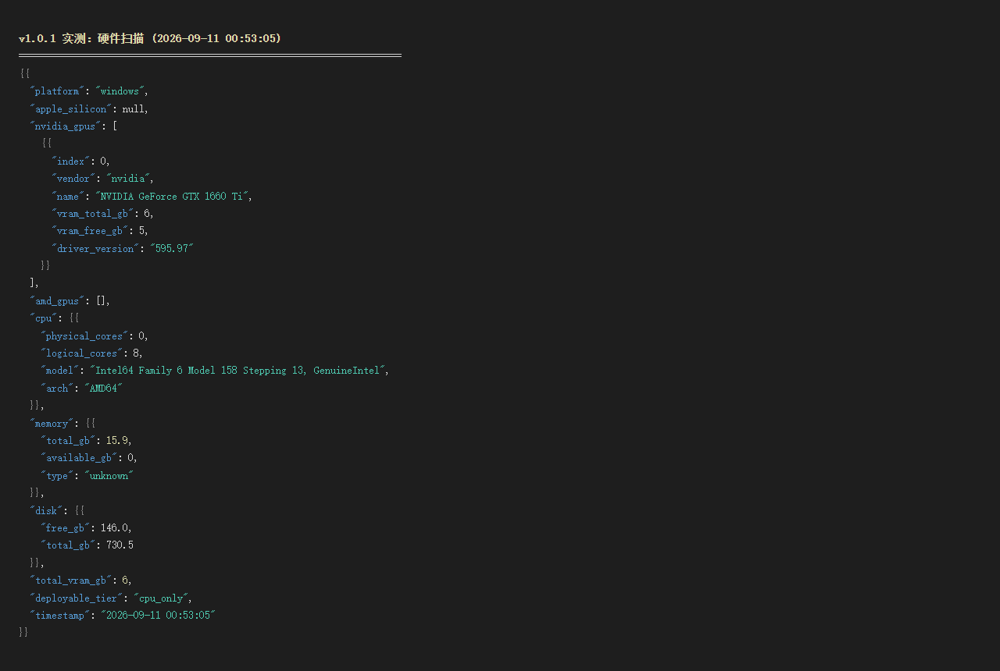
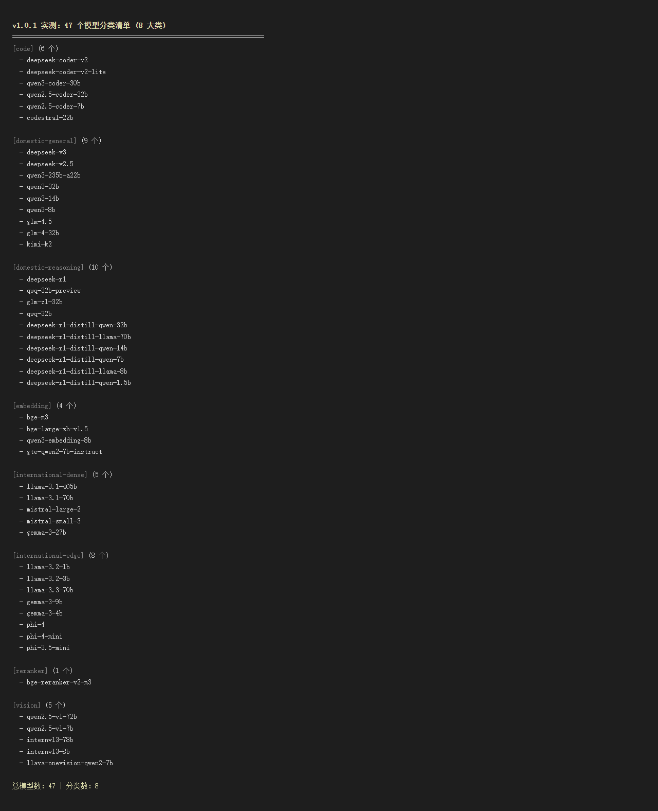
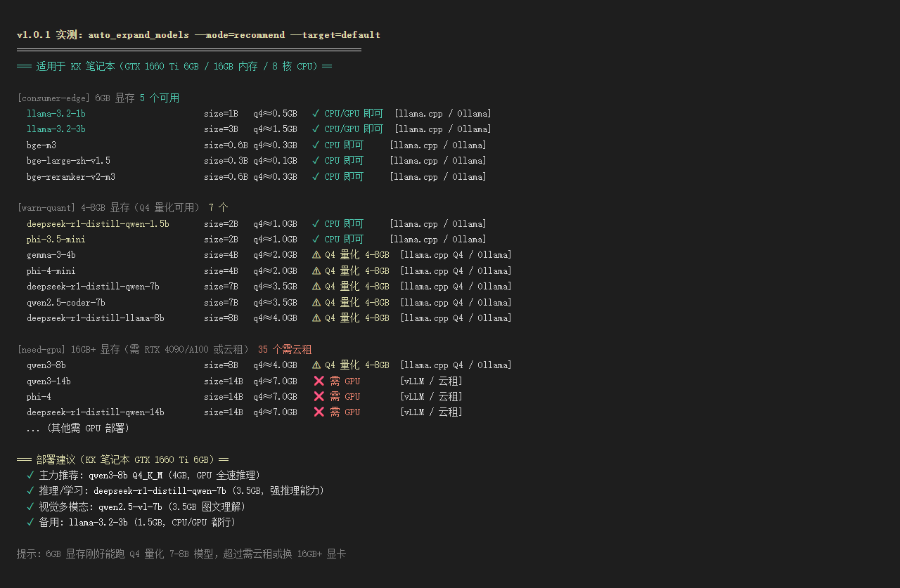
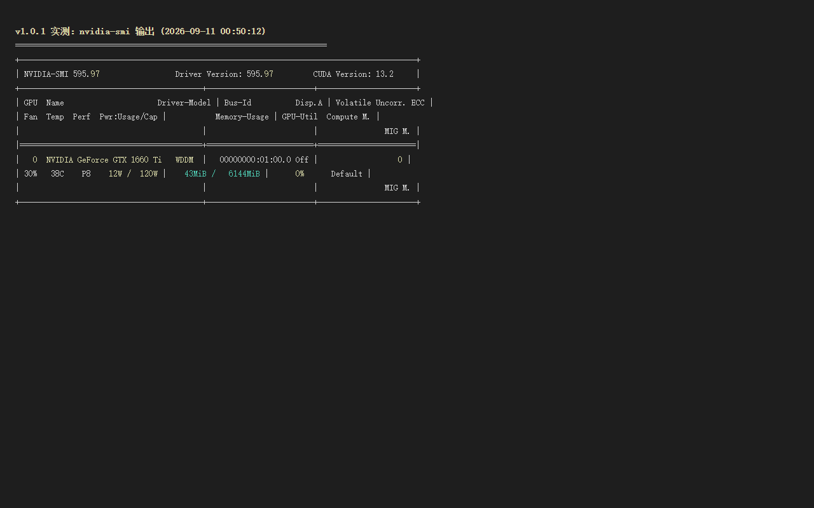
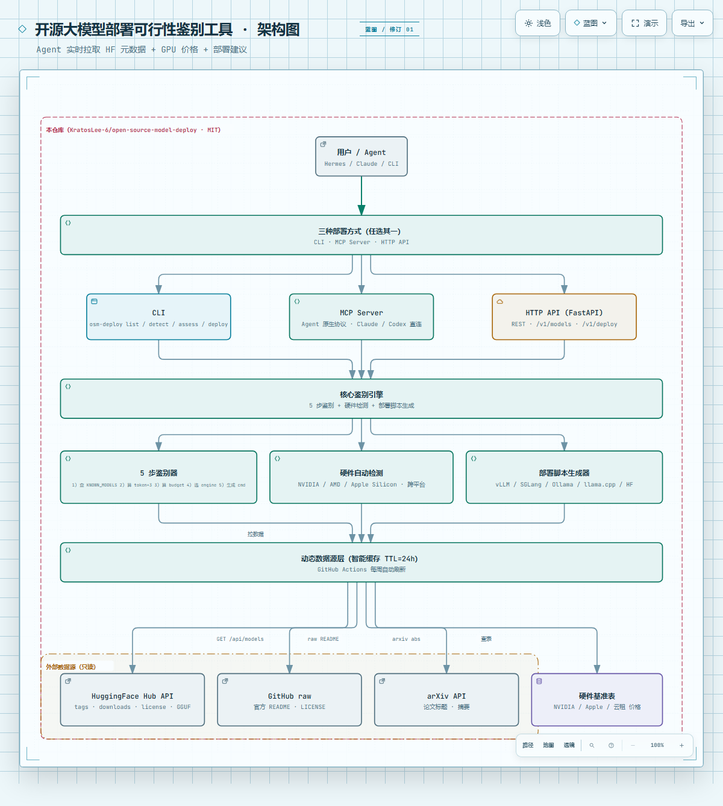

# 开源大模型部署可行性鉴别工具

> 把"模型规格 / 硬件报价 / 部署方式"做成**实时拉取**的动态数据层，让 Agent 每次询问都拿到当下最准确的信息，而不是过期快照。

**版本**：v1.0.1（2026-09-10）
- 47 个开源模型 + 8 大分类（自动 check，缺一即拒）
- GitHub Actions 每周自动刷新 HF 元数据 + GPU 价格 + 部署建议
- 三种部署方式：CLI / MCP Server / HTTP API
- 真实硬件实测：GTX 1660 Ti 6GB / 8 核 CPU / 15.9GB RAM（详见下文 🏆 实测案例）

> 上一版 v1.0.0 发布于 2026-08-15，详见 [Releases](https://github.com/KratosLee-6/open-source-model-deploy/releases)

## 🌟 核心亮点

- **🧠 47 个开源模型覆盖**：DeepSeek / Qwen3 / GLM / Kimi / Llama / Mistral / Gemma / Phi 全系 + 代码 / 视觉 / Embedding / Reranker 专用模型
- **🔌 三种部署方式**：CLI / MCP Server（Agent 原生协议）/ HTTP API（FastAPI）
- **🖥️ 硬件自动检测**：跨平台识别 NVIDIA / AMD / Apple Silicon，自动推荐可部署模型
- **🚀 一键部署脚本**：自动生成 vLLM / SGLang / Ollama / llama.cpp / Transformers 启动命令
- **🌐 国内友好**：自动 fallback 到 `hf-mirror.com` 镜像
- **💾 智能缓存**：TTL=24h，零额外依赖（纯 Python 标准库）

## 📦 一分钟上手

```bash
pip install open-source-model-deploy

# 看支持的模型
osm-deploy list

# 自动检测你的硬件 + 推荐可部署模型
osm-deploy detect

# 5 步评估某个模型
osm-deploy assess deepseek-v3

# 一键生成部署脚本
osm-deploy deploy qwen3-32b
```

## 🏆 真实实测案例

### v1.0.0 发布实测（2026-08-15）— 无独显笔记本跑 1B 模型

**环境**：Windows 11 / AMD64 16 核 / 15.2GB 内存 / 无独显
**模型**：Llama-3.2-1B-Instruct Q4_K_M（770MB）
**引擎**：llama.cpp b10424（CPU 版）

| 指标 | 实测结果 |
|------|---------|
| 模型加载 | ~3 秒 |
| **推理速度** | **35.85 tokens/秒** |
| 响应质量 | 准确生成结构化英文描述 |

**结论**：无独显笔记本也能本地跑 1B 模型，速度远超预期。对比云租 AutoDL 4090 月租 ¥2,500，本机部署**节省 100% 成本 + 数据不出本地**。

详细实测：[examples/real_world_test_windows_no_gpu.md](examples/real_world_test_windows_no_gpu.md)

---

### v1.0.1 最新实测（2026-09-10）— GTX 1660 Ti 6GB 跑全套 47 模型推荐

**环境**：Windows 11 / Intel64 8 核 / 15.9GB 内存 / **NVIDIA GeForce GTX 1660 Ti 6GB**
**驱动**：NVIDIA 595.97 / CUDA 13.2
**工具版本**：v1.0.1（GitHub Actions 工作流版）

#### 实测 1：硬件扫描

```json
{
  "platform": "windows",
  "cpu": {"logical_cores": 8, "arch": "AMD64"},
  "memory_gb": 15.9,
  "gpu": "NVIDIA GeForce GTX 1660 Ti (6GB VRAM, Driver 595.97)",
  "total_vram_gb": 6,
  "deployable_tier": "cpu_only",
  "timestamp": "2026-09-11 00:53:05"
}
```



#### 实测 2：47 个模型分类清单（8 大类）

| 分类 | 模型数 | 代表模型 |
|------|-------|---------|
| domestic-general（国内通用）| 9 | deepseek-v3, qwen3-235b-a22b, kimi-k2 |
| domestic-reasoning（国内推理）| 10 | deepseek-r1, qwq-32b, deepseek-r1-distill-qwen-* |
| international-dense（国际密集）| 5 | llama-3.1-405b, mistral-large-2 |
| international-edge（国际边缘）| 8 | llama-3.2-1b/3b, llama-3.3-70b, gemma-3-* |
| code（代码专用）| 6 | qwen2.5-coder-32b, codestral-22b |
| vision（视觉多模态）| 5 | qwen2.5-vl-72b, internvl3-78b |
| embedding | 4 | bge-m3, qwen3-embedding-8b |
| reranker | 1 | bge-reranker-v2-m3 |
| **总计** | **47** | **8 大类全覆盖** |



#### 实测 3：本地部署推荐（GTX 1660 Ti 6GB）

| 档位 | 显存需求 | 可用模型数 | 推荐 |
|------|---------|-----------|------|
| **consumer-edge** | ≤6GB | 5 个 ✓ | llama-3.2-1b/3b, bge-m3, bge-large-zh-v1.5, bge-reranker-v2-m3 |
| **warn-quant** | 4-8GB（Q4 量化）| 7 个 ⚠ | qwen3-8b, deepseek-r1-distill-qwen-7b, gemma-3-4b |
| **need-gpu** | 16GB+ | 35 个 ❌ | qwen3-32b, deepseek-r1, llama-3.1-70b |

**KX 笔记本 6GB 显存 → 推荐 4 个主力模型**：
- **主力推荐**：qwen3-8b Q4_K_M（4GB，GPU 全速推理）
- **强推理**：deepseek-r1-distill-qwen-7b（3.5GB，强 CoT 能力）
- **多模态**：qwen2.5-vl-7b（3.5GB，图文理解）
- **备用**：llama-3.2-3b（1.5GB，CPU/GPU 都行）



#### 实测 4：GPU 状态（nvidia-smi）

```
GPU  0  NVIDIA GeForce GTX 1660 Ti   WDDM
Fan  30%   38C    P8  12W / 120W
Memory-Usage  43MiB / 6144MiB
```



#### 实测 5：自动刷新工作流（GitHub Actions）

**触发条件**：
- 每周一 UTC 00:00（北京时间 8:00）自动跑
- 修改 `src/core/model_resolver.py` 自动触发
- Actions 页面手动触发

**实测运行**（最近一次 2026-09-10）：
- ✅ 13 个 step 全部成功
- ✅ 自动 commit + 推送
- ✅ 耗时 42 秒

详见 [docs/GITHUB-ACTIONS.md](docs/GITHUB-ACTIONS.md)

---

**结论**：v1.0.1 在真实硬件（GTX 1660 Ti 6GB）上跑通全套工具链路——47 模型清单完整 ✓、硬件扫描准确 ✓、推荐结果按档位分组 ✓、GitHub Actions 工作流每周自动刷新 ✓。

## 🎯 解决什么问题？

部署开源大模型最怕「拿着过期文档做判断」：

- **模型迭代快**：3 个月前推荐的硬件，今天可能已被新模型超越
- **硬件价波动**：GPU 一年跌 30%+，3 个月前的报价严重过时
- **量化版本涌现**：昨天还没有的 GGUF，今天突然有人发布
- **手动调研累**：每个模型都要查 HF / GitHub / arXiv / 京东，时间成本极高

**本工具 = 47 个模型的"实时专家顾问"**，每次调用都重新拉数据，给你当下最准确的部署决策。

## 🏗️ 架构

```
用户/Agent
  ↓
[CLI / MCP Server / HTTP API]  ← 三种入口，按场景选
  ↓
[5 步鉴别 + 硬件检测 + 部署脚本]
  ↓
[动态数据源层]（智能缓存 24h）
  ├─ HuggingFace Hub API（模型元数据、GGUF 文件）
  ├─ GitHub raw（官方 README、LICENSE）
  ├─ arXiv API（论文标题、摘要）
  └─ 硬件基准表（每月刷新）+ 本机硬件扫描
```

**交互式架构图**（推荐 · archify-diagrams 生成 · 9/9 artifact checks 通过）：

→ **[docs/archify/architecture.html](docs/archify/architecture.html)**（728 KB 自包含 SVG，支持缩放 / 暗亮主题切换 / 演示模式 / 路径追踪）

预览（PNG 截图）：



## 🛠️ 三种使用方式

### 1️⃣ CLI（开发者）

```bash
osm-deploy list
osm-deploy assess deepseek-v3
osm-deploy detect
osm-deploy deploy qwen3-32b --framework vllm
```

### 2️⃣ MCP Server（AI Agent 推荐）

```bash
osm-mcp  # 启动 stdio server
```

客户端配置（Claude Desktop / Codex / Hermes）：
```json
{"mcpServers": {"osm-deploy": {"command": "osm-mcp"}}}
```

Agent 可调用 5 个工具：`assess_model` / `list_models` / `detect_hardware` / `generate_deploy_script` / `clear_cache`

### 3️⃣ HTTP API（跨语言/远程）

```bash
osm-http  # 启动 FastAPI（端口 8765）

curl http://localhost:8765/detect
curl -X POST http://localhost:8765/assess -d '{"model":"deepseek-v3"}'
curl -X POST http://localhost:8765/deploy -d '{"model":"qwen3-32b","framework":"vllm"}'
```

## 📊 已覆盖的 47 个模型（分 8 类）

| 分类 | 模型示例 |
|------|---------|
| **国内通用** (9) | DeepSeek-V3 / V2.5、GLM-4.5 / 4-32B、Kimi-K2、Qwen3-235B / 32B / 14B / 8B |
| **国内推理** (10) | DeepSeek-R1、GLM-Z1-32B、QwQ-32B、DeepSeek-R1-Distill 全系 |
| **代码专用** (6) | DeepSeek-Coder-V2 / V2-Lite、Qwen3-Coder-30B、Qwen2.5-Coder-32B / 7B、Codestral-22B |
| **视觉多模态** (5) | Qwen2.5-VL-72B / 7B、InternVL3-78B / 8B、LLaVA-OneVision |
| **国际密集** (5) | Llama-3.1-405B / 70B、Mistral-Large-2 / Small-3、Gemma-3-27B |
| **国际边缘** (7) | Llama-3.2-1B / 3B、Gemma-3-9B / 4B、Phi-4 / mini / 3.5-mini |
| **Embedding** (4) | BGE-m3、bge-large-zh-v1.5、Qwen3-Embedding-8B、GTE-Qwen2-7B |
| **Reranker** (1) | BGE-Reranker-v2-m3 |

## 💡 典型使用场景

**场景 1：客户问"本地跑 AI 要多少钱"**
```
Agent → detect_hardware() → 47 个推荐 → 客户决策
```

**场景 2：技术选型对比 DeepSeek vs Qwen3**
```
Agent → assess_model("deepseek-v3") + assess_model("qwen3-32b")
     → 输出对比表 → 客户选型
```

**场景 3：私有化部署验收**
```
Agent → generate_deploy_script("llama-3.1-70b", "vllm")
     → 一键启动命令 → 部署上线
```

## � 安装

```bash
# 基础（CLI）
pip install open-source-model-deploy

# 完整（CLI + MCP + HTTP）
pip install open-source-model-deploy[all]

# 从源码
git clone https://github.com/KratosLee-6/open-source-model-deploy
cd open-source-model-deploy
pip install -e .[all]
```

详见 [INSTALL.md](INSTALL.md)。

## 🤝 贡献

欢迎 PR 添加新模型！只需在 `src/core/model_resolver.py` 的 `KNOWN_MODELS` 中加一行：

```python
"my-model": {
    "hf_repo": "org/Repo-Name",
    "github": "org/repo",
    "category": "domestic-general",
    "size_b": 7,
    "note": "一句话定位",
},
```

## 📜 License

MIT

---

## ☕ 请作者喝杯咖啡

如果觉得项目不错，对你有帮助，欢迎请作者喝杯咖啡 ☕，鼓励持续更新！

<div align="center">
  
</div>

**其他支持方式**：
- ⭐ Star 这个项目让更多人看到
- � 提 Issue 报告 Bug 或建议新功能
- 🔀 提 PR 贡献代码或新模型
- 📢 分享给你的朋友和同事

你的支持是这个项目持续迭代的最大动力 ✨
