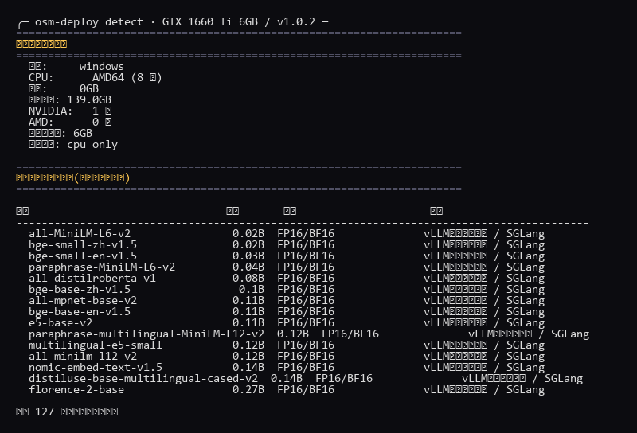
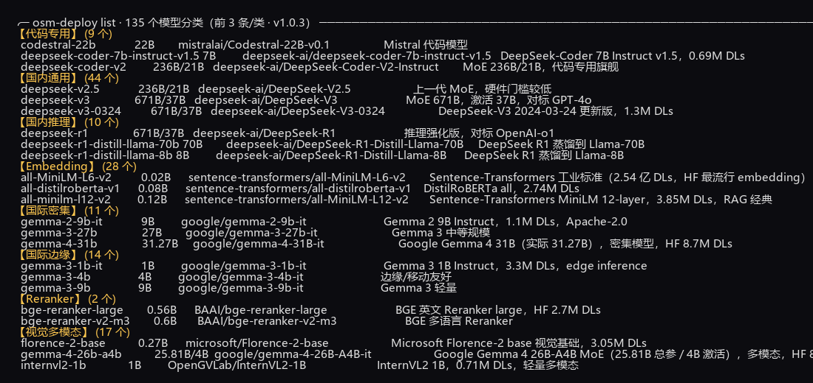
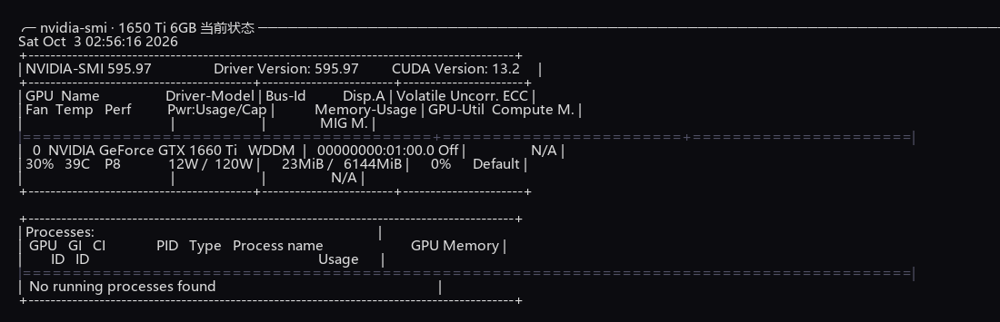
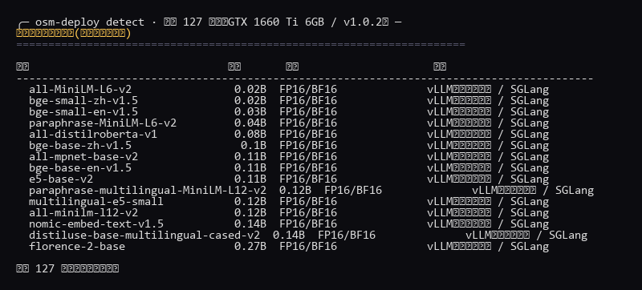
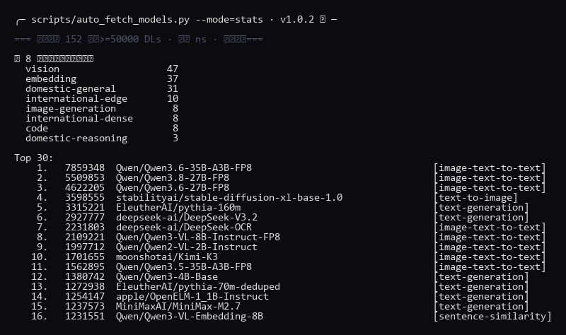
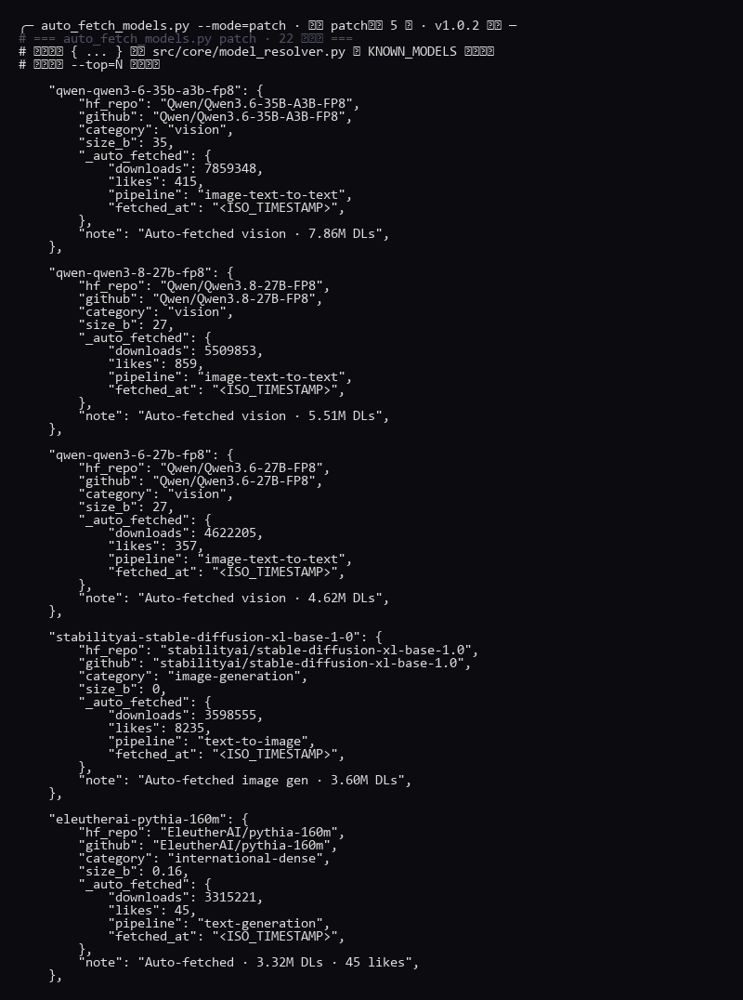
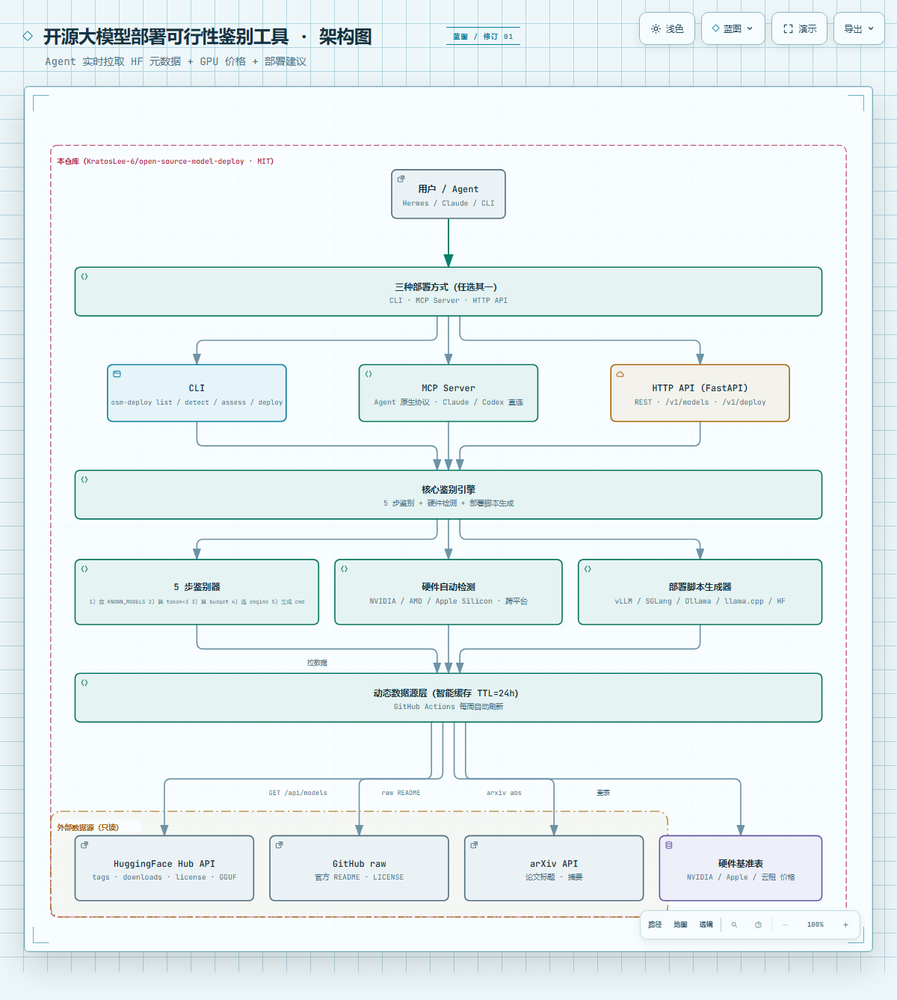

# 开源大模型部署可行性鉴别工具

> 把「模型规格 / 硬件报价 / 部署方式」做成**实时拉取**的动态数据层，让 Agent 每次询问都拿到当下最准确的信息，而不是过期快照。

[](docs/releases/v1.0.3.md) [](references/vram-requirements.md) [](LICENSE) [](pyproject.toml)

**v1.0.3**（2026-10-03 发布）· 135 个在架模型 · 8 大分类 · CLI / MCP Server / HTTP API 三通道

---

## ⚠️ 如果你只用 v1.0.2 的结论买过硬件，请先看这段

v1.0.2 对 MoE 模型的显存是**按激活参数算的**，这是错的：

> MoE 的 expert 权重**全部常驻显存**，稀疏激活只降低计算量（FLOPs），不降低权重占用。

实测后果（24GB RTX 4090 场景）：

| 模型 | 总参 / 激活 | v1.0.2 算出的显存 | 当时的判定 | 实际 Q4 需求 |
| --- | --- | ---: | --- | ---: |
| Kimi-K2 | 1000B / 32B | 23.0 GB | `tight` → **建议能跑** | **720 GB** |
| Qwen3-235B-A22B | 235B / 22B | 15.8 GB | `fits` → **建议能跑** | **169 GB** |
| GLM-4.5 | 355B / 32B | 23.0 GB | `tight` → **建议能跑** | **256 GB** |

v1.0.3 已修正为按总参计算。**完整复盘见 [`docs/moe-vram-pitfall.md`](docs/moe-vram-pitfall.md)**，
它同时也是一份可迁移的判据清单（如果你也在做「模型 × 硬件」匹配，那篇能直接用）。

---

## 🌟 核心亮点

- **🧠 135 个在架模型 · 8 大分类**（另 1 个已退役标注，共 136 条记录）——
  DeepSeek / Qwen3 / MiMo / GLM / Kimi / Llama-4 / Mistral / Gemma / Phi 全系，
  加代码 / 视觉 / Embedding / Reranker 专用模型
- **🧮 结构化显存需求**——每个模型 × 6 档量化都有显存数值和可行性判定，
  `list_models?max_vram_gb=24` 一次就能筛出消费级显卡跑得动的清单
- **🔌 三通道**——CLI（开发者）/ MCP Server（Agent 原生）/ HTTP API（跨语言远程）
- **🖥️ 硬件自动检测**——跨平台识别 NVIDIA / AMD / Apple Silicon，推荐可部署模型
- **🚀 一键部署脚本**——自动生成 vLLM / SGLang / Ollama / llama.cpp / Transformers 启动命令
- **🩺 数据可信度有卡口**——模型库体检（`lint_models.py`）作为 CI 第一个业务 step，
  挡住「总参 / 激活参」这类会导致错误采购建议的数据错误
- **🌐 国内友好**——自动 fallback 到 `hf-mirror.com` 镜像
- **💾 智能缓存**——TTL=24h，零额外依赖（纯 Python 标准库）

---

## 📦 一分钟上手

```bash
pip install open-source-model-deploy

# 看支持的模型（135 个在架）
osm-deploy list

# 自动检测硬件 + 推荐可部署模型
osm-deploy detect

# 5 步评估某个模型
osm-deploy assess deepseek-v3

# 一键生成部署脚本
osm-deploy deploy qwen3-32b
```

---

## 🧮 显存需求（v1.0.3 新增）

这是这一版最实用的能力：**不再需要自己查「这个模型要多少显存」**。

每个模型给出 6 档量化的显存数值（Q4_K_M / Q5_K_M / Q6_K / Q8_0 / FP8 / BF16），
并给出单卡 / 多卡的可行性判定。完整 135 行对照表见
[`references/vram-requirements.md`](references/vram-requirements.md)（自动生成，与代码同步），
机器可读版本见 [`data/models-knowledge.json`](data/models-knowledge.json)。

**按显存反查能跑什么**（MCP / HTTP 均可用）：

| 查询 | 返回 |
| --- | ---: |
| `list_models?max_vram_gb=8` | 77 个 |
| `list_models?max_vram_gb=16` | 86 个 |
| `list_models?max_vram_gb=24` | 104 个 |
| `list_models?max_vram_gb=80` | 113 个 |

**几个真实判定示例**（Q4_K_M 单卡）：

| 模型 | 规模 | Q4 显存 | 24GB 4096 能跑吗 |
| --- | --- | ---: | --- |
| `mimo-v2.6-distill-qwen-9b` | 9.4B 密集 | 6.8 GB | ✅ 轻松 |
| `qwen3-32b` | 32B 密集 | 23.0 GB | ✅ 刚好 |
| `llama-4-scout-17b` | 108.6B MoE / 17B 激活 | 78.2 GB | ❌ 差 3 倍 |
| `kimi-k3` | 2779.9B MoE / 119B 激活 | 2001.5 GB | ❌ 集群级 |

> 💡 注意 MoE 那两行：`Llama-4-Scout-17B-16E` 模型名里的 **17B 是激活参不是总参**，
> 真实总参 108.6B。这类命名很容易踩坑，本工具的 `size_b` 一律取自
> HuggingFace `safetensors.total` 实测值。

---

## 📊 已覆盖的 135 个模型（8 类 · 2026-10-03）

| 分类 | 模型数 | v1.0.3 新增代表 |
| --- | ---: | --- |
| **国内通用** | 44 | **MiMo-V2.6-Pro / Flash / Distill-Qwen-9B**（小米，当前开源权重第一）· **GLM-5.3 / 5.3-Flash** · **Kimi-K3** |
| **Embedding** | 28 | （无新增） |
| **视觉多模态** | 17 | （无新增） |
| **国际边缘** | 14 | （无新增） |
| **国际密集** | 11 | **Llama-4-Scout-17B-16E / Maverick-17B-128E**（Meta 首部 Llama 4） |
| **国内推理** | 10 | （无新增） |
| **代码专用** | 9 | **Qwen3-Coder-480B-A35B**（Apache-2.0，480B MoE / 35B 激活） |
| **Reranker** | 2 | （无新增） |
| **总计** | **135** | 较 v1.0.2 的 127 **+9**；另 1 个已退役标注（DeepSeek-V4-Flash → V4.1-Flash）不计入 |

各类代表模型速览：

| 分类 | 模型示例 |
| --- | --- |
| **国内通用** (44) | DeepSeek-V3 / V4.1-Flash / V2.5 · GLM-5.3 / 4.5 · Kimi-K3 / K2 · MiMo-V2.6 全系 · Qwen3-235B / 32B / 14B |
| **国内推理** (10) | DeepSeek-R1 全系（含 Distill）· GLM-Z1-32B · QwQ-32B |
| **代码专用** (9) | Qwen3-Coder-480B / 30B · Qwen2.5-Coder-32B / 14B / 7B · DeepSeek-Coder-V2 · Codestral-22B |
| **视觉多模态** (17) | Qwen2.5-VL-72B / 7B · Qwen3-VL-32B · InternVL3-78B / 8B · LLaVA-OneVision · Florence-2-base |
| **国际密集** (11) | Llama-4-Maverick / Scout · Llama-3.3-70B · Mistral-Large-2 · Gemma-4-31B |
| **国际边缘** (14) | Llama-3.2-1B / 3B · Gemma-3-9B / 4B · Phi-4 / mini · Mistral-7B |
| **Embedding** (28) | BGE 全家桶（M3 / large / base / small 中英）· E5 large/base/small · GTE multilingual / large-en · Nomic · EmbeddingGemma-300M |
| **Reranker** (2) | BGE-Reranker-large · BGE-Reranker-v2-m3 |

---

## 🛠️ 三种使用方式

### 1️⃣ CLI

```bash
osm-deploy list                              # 135 个在架模型
osm-deploy list --category code              # 只看代码模型
osm-deploy list --all                        # 含已退役模型
osm-deploy assess deepseek-v3                # 5 步评估（返回结构化 JSON）
osm-deploy detect                            # 扫硬件 + 推荐
osm-deploy deploy qwen3-32b --framework vllm # 生成启动脚本
```

### 2️⃣ MCP Server（AI Agent 推荐）

```bash
osm-mcp    # stdio server
```

客户端配置（Claude Desktop / Codex / Hermes）：

```json
{"mcpServers": {"osm-deploy": {"command": "osm-mcp"}}}
```

5 个工具：`assess_model` / `list_models` / `detect_hardware` / `generate_deploy_script` / `clear_cache`

`list_models` 支持按显存筛选——这是给 Agent 用的核心能力，一次调用即可拿到
「这台机器跑得动的全部模型」，不必逐个 `assess`：

| 参数 | 类型 | 说明 |
| --- | --- | --- |
| `max_vram_gb` | number | 只返回该显存下放得下的模型，按显存升序 |
| `quant` | string | 判定档位，默认 `Q4_K_M` |
| `category` | string | 按分类过滤 |
| `include_retired` | boolean | 是否含已退役模型，默认 false |

### 3️⃣ HTTP API

```bash
osm-http    # FastAPI，端口 8765

curl http://localhost:8765/detect
curl "http://localhost:8765/list?max_vram_gb=24"
curl -X POST http://localhost:8765/assess -d '{"model":"deepseek-v3"}'
curl -X POST http://localhost:8765/deploy -d '{"model":"qwen3-32b","framework":"vllm"}'
```

---

## 🏆 真实实测（v1.0.3 · 2026-10-03）

**环境**：Windows 11 / i7-9700 8 核 / **15.9GB 内存** / **GTX 1660 Ti 6GB**（driver 595.97）

> 本节全部截图由 `python scripts/regen_screenshots.py` 在**本机真实运行**后生成，
> 不是手工拼图。装好之后跑一遍就能复现全部数字。
> 历史版本（v1.0.0 - v1.0.2）的实测记录见 [`docs/releases/archive.md`](docs/releases/archive.md)。

### 实测 1：硬件扫描 + 可部署判定



这一版顺手修掉了两个会让输出说谎的问题：

| 问题 | 修复前 | 修复后 |
| --- | --- | --- |
| `wmic` 已被 Win11 24H2+ 移除，内存读不出来 | `内存: 0GB` | `内存: 15.9GB`（改用 ctypes `GlobalMemoryStatusEx`） |
| 「可部署数」用的是全库条数 | `总共 136 个模型可在本机部署` | `可部署 83 / 135 个在架模型（其中 11 个仅 CPU 慢速）` |

第二行和本文档开头的 MoE 误判是**同一类错误**：让用户以为自己的机器能跑
它根本跑不动的模型。一个 6GB 显卡上宣称「136 个模型可部署」同样不可接受。

### 实测 2：135 模型分类清单



### 实测 3：GPU 当前状态



### 实测 4：按本机 6GB 显存的部署建议



6GB 显存的实际结果：**135 个在架模型中 83 个可跑**，其中 11 个只能走 CPU 慢速。
无法在 6GB 上跑的包括全部大型 MoE（Kimi-K3 需 2TB、MiMo-V2.6-Pro 需 737GB）。

### 实测 5：`auto_fetch_models.py --mode=stats`



### 实测 6：`auto_fetch_models.py --mode=patch`



v1.0.3 变化：每条生成条目带 `param_source: hf-safetensors`（总参来自 HF API 实测，
不再靠正则猜模型名），且 patch 输出前会先跑 `model_lint` 闸门，ERROR 的候选直接拦下列出原因。

### 实测 7：模型库体检

```bash
$ python scripts/lint_models.py --strict
模型库体检：136 个模型 · ERROR 0 · WARN 0 · INFO 0
✓ 全部通过
```

> 体检口径是**库内全部 136 条记录**（含 1 个已退役标注），
> 与 `list` 命令显示的 135 个在架模型是不同口径，不是矛盾。

---

## 🎯 解决什么问题？

部署开源大模型最怕「拿着过期文档做判断」：

- **模型迭代快**——3 个月前推荐的硬件，今天可能已被新模型超越
- **硬件价波动**——GPU 一年跌 30%+，3 个月前的报价严重过时
- **量化版本涌现**——昨天还没有的 GGUF，今天突然有人发布
- **手动调研累**——每个模型都要查 HF / GitHub / arXiv / 电商，时间成本极高
- **显存算错代价高**——把 MoE 的激活参当总参，会让你以为小显卡能跑大模型

---

## 🏗️ 架构

```
用户 / Agent
  ↓
[CLI / MCP Server / HTTP API]          ← 三种入口，按场景选
  ↓
[5 步鉴别 + 硬件检测 + 部署脚本]
  ↓
[结构化显存层]（v1.0.3 新增 · 可序列化契约）
  └─ 6 档量化 × 多卡均分 × context 影响 × fits/tight/no 判定
  ↓
[动态数据源层]（智能缓存 24h）
  ├─ HuggingFace Hub API（模型元数据、safetensors 参数量、GGUF 文件）
  ├─ GitHub raw（官方 README、LICENSE）
  ├─ arXiv API（论文标题、摘要）
  └─ 硬件基准表（定期刷新）+ 本机硬件扫描
```

**交互式架构图**（archify-diagrams 生成，自包含 SVG，支持缩放 / 暗亮主题 / 演示模式）：
[`docs/archify/architecture.html`](docs/archify/architecture.html)



---

## 💡 典型使用场景

**场景 1：客户问「本地跑 AI 要多少钱 / 我这台机器行不行」**
```
Agent → detect_hardware() → 135 个在架模型 → 83 个可跑 + 显存判定 → 客户决策
```

**场景 2：技术选型对比 DeepSeek vs Qwen3**
```
Agent → assess_model("deepseek-v3") + assess_model("qwen3-32b")
     → 含 6 档量化显存的结构化对比 → 选型
```

**场景 3：按显卡预算反查能跑的模型**
```
Agent → list_models(max_vram_gb=12) → 83 个候选（按显存升序）→ 选型 + 部署脚本
```

**场景 4：私有化部署验收**
```
Agent → generate_deploy_script("llama-3.3-70b-instruct", "vllm")
     → 一键启动命令 → 部署上线
```

---

## 📥 安装

```bash
# 基础（CLI）
pip install open-source-model-deploy

# 完整（CLI + MCP + HTTP）
pip install open-source-model-deploy[all]

# 从源码
git clone https://github.com/KratosLee-6/open-source-model-deploy
cd open-source-model-deploy
pip install -e .[all]
```

详见 [`INSTALL.md`](INSTALL.md)。

---

## 🤝 贡献

### 添加新模型

在 `src/core/model_resolver.py` 的 `KNOWN_MODELS` 里加一条：

```python
"my-model": {
    "hf_repo": "org/Repo-Name",
    "github": "org/repo",
    "category": "domestic-general",
    "size_b": 7,
    "note": "一句话定位",
},
```

**请务必遵守**：

- `size_b` 取 **HuggingFace `safetensors.total` 实测值**（约 `total / 1e9`），
  **不要从模型名里正则抠**。`Llama-4-Scout-17B-16E` 里的 `17B` 是激活参不是总参
- MoE 模型**必须填 `activated_b`**，从模型卡或 `config.json`
  （`n_routed_experts` / `num_experts_per_token`）取
- 填完跑一次体检，ERROR 必须清零：

```bash
python scripts/lint_models.py --strict
python -m pytest tests/ -q
python scripts/export_models_knowledge.py   # 同步知识库
```

想省事的话，`auto_fetch_models.py --mode=patch` 会自动从 HF API 取实测总参
并过一遍 lint 闸门，但 `activated_b` 仍需人工核对。

---

## 📖 版本历史

| 版本 | 日期 | 模型数 | 重点 |
| --- | --- | ---: | --- |
| **v1.0.3** | 2026-10-03 | 135 | 修正 MoE 显存误判 · 显存需求结构化 · 模型库体检 CI 卡口 |
| v1.0.2 | 2026-09-26 | 127 | `auto_fetch_models.py` · 周日自动开 PR |
| v1.0.1 | 2026-09-10 | 94 | 每周自动刷新元数据 + GPU 价格 |
| v1.0.0 | 2026-08-15 | 47 | 首个版本 · 真实硬件推理实测 |

- Release notes：[`docs/releases/`](docs/releases/)
- 历史实测记录：[`docs/releases/archive.md`](docs/releases/archive.md)
- v1.0.3 完整说明：[`docs/releases/v1.0.3.md`](docs/releases/v1.0.3.md)
- MoE 踩坑复盘：[`docs/moe-vram-pitfall.md`](docs/moe-vram-pitfall.md)

---

## 📜 License

MIT © 汐构信息

## ☕ 支持这个项目

如果觉得有用，欢迎请作者喝杯咖啡 ☕

<div align="center">
  
</div>

**其他支持方式**：

- ⭐ Star 这个项目让更多人看到
- 🐛 提 Issue 报告 Bug 或建议新功能
- 🔀 提 PR 贡献代码或新模型
- 📢 分享给你的朋友和同事
